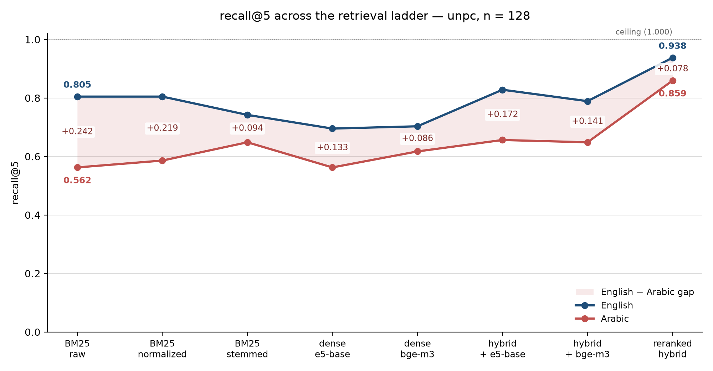

# Bilingual RAG: measuring the retrieval ceiling in Arabic and English

Retrieval caps generation, and the cap is lower in Arabic. This measures both halves on the same
documents and the same questions, differing only in language: a 33,476-chunk subsample of the UN
Parallel Corpus (English–Arabic, sentence-aligned), 128 questions, eight retrieval configurations, and a
generation stage with controls that separate what retrieval costs from what generation costs.

Every number below comes from a committed results file, with the command that produced it. They are not
transcribed by hand: `tests/test_readme_figures.py` reads each figure out of the results JSON and fails if
this README disagrees with it, so `pytest` catches a stale number the way it catches a broken function.

---

## The result

**The Arabic penalty is in retrieval, not in generation.** Same questions, same documents, best
retrieval configuration in the project (RRF over stemmed BM25 and `bge-m3`, reranked by
`bge-reranker-v2-m3` over the top 50):

| Stage | What it measures | English − Arabic | 95% CI |
|---|---|---|---|
| **Retrieval** (recall@5) | finding the passage | **+0.078** | [+0.016, +0.141], McNemar p = 0.031 |
| **Generation, retrieval held perfect** (oracle accuracy) | using the passage | **+0.031** | [+0.000, +0.070] |

Give the model the right passage and Arabic is nearly English: 0.953 against 0.984. Make it find the
passage first and the gap more than doubles.

**The attribution is not an assumption.** Closed-book accuracy — the same questions with no passages at
all — is **0.031 in both languages**, 4 questions of 128, with the model abstaining on over half. UN
documents are public and plausibly in any web-scale training set, so recitation was a real risk to this
design. It did not materialise: whatever this corpus contributed to pretraining, none of it is
retrievable by asking these questions, and memory's contribution to any RAG answer is capped at 3.1%.

`docs/results.md`, `docs/generation.md`.



Absolute scores, not differences: the shaded band is the gap. Every configuration improves both
languages and none of them closes the band, including the reranker at the right-hand end. The same plot
for XQuAD (`docs/figures/ladder-xquad.png`, same script) has both lines meeting at 1.000, which is the
ceiling problem in one picture. Regenerate either with
`python scripts/plot_ladder.py --corpus unpc`.

---

## The same reranker "closes" the Arabic gap on XQuAD and does not close it here

| Corpus | Candidates per question | recall@5 EN | recall@5 AR | Δ EN − AR | McNemar p |
|---|---|---|---|---|---|
| XQuAD | 240 passages | **1.000** | **1.000** | +0.000 [+0.000, +0.000] | 1.0 |
| UN corpus | 33,476 chunks | 0.938 | 0.859 | **+0.078 [+0.016, +0.141]** | 0.031 |

Both numbers are correct and only one of them is about the reranker. At recall@5 = 1.000 in both
languages every gold passage is already in the top 5, so the difference between languages *cannot* be
anything but zero, whatever the reranker does to Arabic. XQuAD is reporting the ceiling of its own
measurement.

**The general rule, which costs nothing to follow: report the absolute score beside the difference.** A
zero difference next to a score of 1.000 is a ceiling, not a finding. Every table in this project carries
both columns for that reason.

The ceiling caveat was written into the XQuAD section before the UN corpus was run, not added after it
disagreed (`docs/results.md`, and the commit history).

**A concrete cost of testing on the saturated benchmark:** `multilingual-e5-base` and `bge-m3` sit three
points apart on XQuAD (en-ar recall@1 0.823 against 0.854) and look interchangeable. On the UN corpus
e5-base collapses to **0.094** where bge-m3 holds **0.367**. The failure is directional — e5-base is fine
at ar-ar (0.398) and ar-en (0.328); only English queries against Arabic passages collapse. Choosing a
cross-lingual retriever on XQuAD would have hidden that completely.

---

## Arabic costs more tokens, and it bites at three different levels

The same content in Arabic needs about 1.12× the subword tokens of English (median over all 33,476
aligned chunks, XLM-R tokenizer). That one ratio produces three unrelated failures.

**1. Embedding truncation, before retrieval starts.** Chunks are sized so that neither language exceeds
the limit, and 50 still pass `multilingual-e5-base`'s 512 tokens: **40 in Arabic only, 0 in English
only**, 10 in both. In those 40 the Arabic/English ratio is 1.44×; they are table-like runs of numbers
and short items, where Arabic's token cost is largest. e5 cuts the end off the Arabic passage while the
English version fits whole, and nothing reports an error. An English-only benchmark cannot show this.

**2. Generation cost, per character and per call.** Fitting `prompt tokens = intercept + slope × field
characters` per language over the usage ledger (`scripts/analyze_scoring.py`):

| Prompt type | English | Arabic | Arabic ÷ English |
|---|---|---|---|
| Judge prompts | 5.95 chars/token | 3.64 chars/token | **1.64×** |
| Answering prompts | 5.46 chars/token | 3.98 chars/token | **1.37×** |

Per call the penalty is smaller, 1.23–1.30×, because Arabic says the same thing in about 0.85 of the
characters. On a fixed daily token budget every Arabic condition costs about a quarter more than its
English twin — a research-design constraint, not just a bill.

**3. Retrieval quality.** The stemming result below is the same cost in another form: Arabic morphology
packed into fewer, denser tokens that BM25's bag of words treats as unrelated strings.

---

## Reversed digit groups: a real corpus defect, and a null result on fixing it

UN Arabic text as distributed writes 50,000 as `000 50` — digit groups in reverse order.
`scripts/build_unpc.py` corrects **3,600 numbers across 1,604 chunks**, using the aligned English to
confirm each one, and writes a corrected *and* an uncorrected corpus so the correction itself can be
measured.

**What correcting it is worth to retrieval: nothing measurable.** On the 43 numeric questions, corrected
minus uncorrected, Arabic:

| Config | Δ recall@5 | Δ MRR@10 | What moved |
|---|---|---|---|
| bm25-raw, bm25-norm, bm25-light | +0.000 | +0.000 | nothing: identical token multisets |
| e5-base | +0.023 [+0.000, +0.070] | +0.001 | one question of 43 |
| bge-m3 | +0.000 | +0.010 [−0.024, +0.045] | no question enters or leaves the top 5 |

BM25's zero is structural and was predicted: a bag of words does not care about group order. **The dense
zero was not predicted** — embedding models read token order, and this was the case where the correction
should have paid off.

The correction stays, because it matters where text is read rather than matched: exact-match scoring of
"50,000" against a span reading `000 50` fails, and the Arabic gold answers would otherwise carry
garbled numbers. Its value is in answer scoring, not retrieval. Measuring it is what stopped "the numbers
were corrected" from implying, silently, that retrieval improved. **56 decimal amounts** (`538.6 5` for
5,538.6) remain reversed in both corpus versions; none appears in the gold passages of the 43 questions.

---

## Evaluation fragility: four checking rules, measured

What decides which questions exist, and which answers count as correct, is mostly the checking rule —
not the model (`docs/corpus.md` §3).

**1. A 0.5 token-overlap threshold accepted a wrong answer.** SQuAD-style token F1 at the usual threshold
let through an answer sharing enough words with the reference while stating a different fact. The
threshold was removed and replaced by a same-fact judgement; F1 is still recorded, never used as a gate.

**2. Swapping the verifier model changed one verdict in 68.** The original verifier (`qwen/qwen3.6-27b`)
was withdrawn mid-project with no deprecation notice, so every candidate was re-verified with
`qwen/qwen3.8-27b`. The swap is reassuring about model choice and proves nothing about correctness: **a
swap cannot detect an error both models share.**

**3. The shared blind spot the swap test could not see.** Of 14 same-answer rejections inspected by hand,
**6 were the same fact rejected**, in four patterns. Three were a lower-bound qualifier treated as a
different fact: "75 000" against "over 75,000", "5,000" against ما يزيد على 5 000 مرشح. Both models did
it, on every case replayed, against the prompt's explicit instruction. The numeric question set is
biased against facts stated as "more than N".

**4. Exact match rejects answers the judge accepts — 65 times, and never the reverse.** On the same 240
oracle answers, the judge accepted an answer exact match rejected 65 times; the reverse happened in
**zero** cases. Mostly dropped units and qualifiers (`14,443 persons` → `14,443`). The Arabic-specific
part is digit grouping, which is the corpus's own convention: UN Arabic writes `2 392`, English writes
`2,392`, and a comma survives tokenization inside one token where a space does not.

**1 and 4 are the same failure in opposite directions.** Token overlap admitted a wrong answer because it
shared words; exact match rejects correct answers because they do not share all of them. Neither is a
statement about whether the answer is right. Using exact match as the accuracy measure would report the
oracle language gap as +0.172 instead of +0.031 — five times larger, almost entirely scoring rule.

---

## Stemming removes the same share of the gap on both corpora, but not in the way it looks

| Corpus | bm25-raw | bm25-light | Share of the gap removed |
|---|---|---|---|
| XQuAD | +0.047 | +0.019 | 60% |
| UN corpus | +0.242 | +0.094 | 61% |

Read as a headline, that says about 60% of naive BM25's Arabic penalty is the tokenizer — clitics like
و، ب، ال left attached — rather than the language, at both scales. The absolute scores say something
less flattering.

**42% of the gap that closes is English getting worse.** Light stemming raises Arabic recall@5 from 0.562
to 0.648 (+0.086) and *lowers* English from 0.805 to 0.742 (−0.063). The gap narrows by 0.149, and 0.063
of that narrowing is the English side coming down to meet Arabic.

This matters because the gap is the headline number and the analyzer is a preprocessing choice made by
the person reporting it. **Choosing the analyzer that minimises a language gap selects, in part, for
damage to the stronger language,** and a gap-only table cannot show it: +0.242 → +0.094 reads as
unambiguous progress. The stemmed configuration is still what this project's hybrid uses, because 0.648
beats 0.562 for Arabic — but the English cost is part of that choice and is reported with it.

**What survives stemming is not separable from zero here:** +0.094 [+0.000, +0.195], p = 0.088 at
n = 128. That is a limit of the sample, not evidence that stemming closes the gap.

---

## Multi-hop: three attempts, three measured causes, none built

Each construction was tested against a stop rule fixed before the test, and each failed differently.

| Construction | Test | Result | Cause |
|---|---|---|---|
| Citation bridges (passage A cites document B) | 20 candidates; stop below 5 accepted | **0 of 20** | the link exists only in metadata: B's text names its own symbol in 3 of 233 candidates, so B answers alone |
| Comparisons over a shared UNBIS subject term | 20 candidates; same rule | **0 of 20** | shared subject terms are topical, not parallel; the generator declined 15 of 20 pairs |
| Deterministic comparisons of mission-financing appropriations | no LLM: gate of ≥ 60 pairs and ≤ 1 of 30 records wrong | 101 pairs, **2 of 30 wrong** | template-parallel documents still need per-template rules; stopped rather than patch extraction until a sample passed |

**The project is therefore single-hop.** AllRecall@k — where hybrid retrieval and reranking were expected
to separate from dense-only retrieval — cannot be reported, and the planned query-decomposition agent has
nothing to decompose. Three negative results with causes are the honest output; a fourth attempt with
looser rules would have produced questions and no finding.

---

## Status

| Part | State |
|---|---|
| Corpus and question set | complete: 1,250 documents, 33,476 chunks, 128 questions (88 single-hop + 40 numeric), frozen |
| Retrieval, XQuAD and UN corpus | complete: 8 configurations, both languages, both corpus versions |
| Generation: closed-book and oracle | complete and judged, n = 128 per language |
| Generation: RAG with the reranked hybrid | **in progress — 57 of 256 answers**, resuming at each daily quota limit |
| Hallucination / support judgements | not started; judged on the RAG condition only |
| RAG with stemmed BM25 (a second retrieval condition) | a bonus, only if quota allows |
| Human audit: 100 questions + 100 judge decisions | not started |
| Query-decomposition agent | not possible on this question set; see multi-hop |

The RAG condition's accuracy was **predicted and committed before those answers existed**
(`docs/generation.md`): 0.925 English, 0.823 Arabic, gap +0.102, from
recall@5 × oracle + (1 − recall@5) × closed-book. The prediction and the outcome will be reported
together, with the three assumptions behind it, whichever way it lands.

---

## What doesn't work

**What the limitations do not touch:** the retrieval/generation split is measured, not inferred — the
closed-book control shows the model answers 3.1% of these questions from memory, so the oracle and RAG
conditions are reading the passages. The XQuAD ceiling result is methodological and holds for any
saturated benchmark. And the Arabic token cost, the truncation and the reversed digit groups are
measurements of the data itself, which no choice of model changes. What follows limits how far the
numbers generalise; it does not put them in doubt.

**One corpus, one domain, one register.** UN documents from 2002–2013, in formal MSA written by
professional translators, with the Arabic translated from the English. Nothing here transfers to dialect
or to natively written Arabic, and the translation makes the task easier than reality, so the measured
gap is plausibly a lower bound.

**128 questions, so most intervals are wide.** The reranked gap, +0.078 [+0.016, +0.141], clears zero but
does not pin the size, and the 43-question numeric subset carries nothing on its own (+0.023 [−0.093,
+0.140], p = 1). The set was frozen at 128 for quota reasons, not statistical ones.

**Every result is single-hop.** Three multi-hop constructions were measured and stopped, so "retrieval
caps generation" is shown for one-passage questions — not for the multi-passage case where retrieval
failures compound.

**The judge is the same model as the question verifier** (`qwen/qwen3.8-27b` in both roles). The verifier
decided which questions exist and what their reference answers are; the judge decides whether an answer
matches that reference, so a systematic error in one is the same error in the other and every internal
check still passes — including the swap test, which found agreement partly *because* the bias is shared.
Only the human audit of 100 questions and 100 judge decisions closes this, and **it has not been done**,
so every accuracy number here is conditional on a judge no person has checked.

**Still missing:** the hallucination rate, the second retrieval condition and the human audit. Any
statement about grounding in Arabic is, at the time of writing, unmeasured.

`docs/limitations.md` has the rest: the undiagnosed e5-base collapse and the one-of-everything problem,
how the questions inherit passage vocabulary, what free-tier quota decided about the design, the two
reproducibility holes, and why nothing here speaks to corpora of millions of chunks.

---

## Data and licences

The code in this repository is MIT-licensed (`LICENSE`). The corpora are not covered by that licence and
keep their own terms.

**United Nations Parallel Corpus v1.0** — the main corpus, via OPUS. 114,047 English–Arabic document
pairs → 35,979 eligible → 1,250 selected (1,000 seed + 250 cited) → **33,476 aligned chunks**, each
holding the same content in both languages (`docs/corpus.md`).

> Source: United Nations. The corpus is provided by the UN without warranty of any kind, and users must
> acknowledge the United Nations as the source.
>
> Ziemski, M., Junczys-Dowmunt, M., & Pouliquen, B. (2016). *The United Nations Parallel Corpus v1.0.*
> Proceedings of the Tenth International Conference on Language Resources and Evaluation (LREC 2016).
> https://www.un.org/dgacm/en/content/uncorpus

**XQuAD** — the human-question control: 240 Wikipedia paragraphs and 1,190 questions in English and
Arabic. Licensed **CC BY-SA 4.0**, as is SQuAD 1.1, from which it is derived.

> Artetxe, M., Ruder, S., & Yogatama, D. (2020). *On the Cross-lingual Transferability of Monolingual
> Representations.* Proceedings of ACL 2020. https://github.com/google-deepmind/xquad
>
> Rajpurkar, P., Zhang, J., Lopyrev, K., & Liang, P. (2016). *SQuAD: 100,000+ Questions for Machine
> Comprehension of Text.* Proceedings of EMNLP 2016.

**What this repository distributes:** code, documentation, and results files containing metrics and
identifiers (chunk ids, question ids, scores). Corpus text, questions and answers live under `data/`,
which is git-ignored and rebuilt locally from the sources above; no corpus text is redistributed here.
The UN corpus terms carry no non-commercial or no-derivatives clause, which is why it was chosen over
TED2020 (CC BY-NC-ND 4.0) for a project that publishes derived questions (`docs/design.md` §3.2).

**Questions:** 128 (88 single-hop + 40 numeric), written from UN passages, blind-translated, verified,
frozen. 43 contain a grouped number and form the numeric subset.

**Models,** all used under their own licences: `intfloat/multilingual-e5-base`, `BAAI/bge-m3`,
`BAAI/bge-reranker-v2-m3` (Hugging Face), and `openai/gpt-oss-120b`, `openai/gpt-oss-20b`,
`qwen/qwen3.8-27b` through the Groq API.

## Repository

| Path | What is in it |
|---|---|
| `src/rageval/` | corpus building, retrieval (BM25, dense, RRF, reranking), metrics, LLM client with disk cache |
| `scripts/` | one step each: `build_unpc.py`, `build_questions.py`, `run_retrieval.py`, `evaluate.py`, `run_generation.py`, `score_generation.py`, `analyze_scoring.py` |
| `configs/pilot.yaml` | every parameter, model and gate, plus the frozen-data fingerprints |
| `docs/design.md` | the design, and every change made while building, with reasons |
| `docs/corpus.md` | corpus and question-set findings, evaluation fragility, multi-hop attempts |
| `docs/results.md` | retrieval tables, XQuAD and UN corpus |
| `docs/generation.md` | generation controls, contamination gate, the pre-registered RAG prediction |
| `docs/limitations.md` | the full limitations list, of which the README keeps five |
| `docs/kaggle.md`, `docs/colab.md` | running the GPU steps |
| `scripts/plot_ladder.py`, `docs/figures/` | the figure above, regenerated from the results file |
| `LICENSE` | MIT, with the corpus terms it does not cover |
| `tests/` | 186 tests: analyzers, BM25, fusion, metrics, bootstrap and McNemar, chunking, number correction, and every figure in this README against the results files |

## Setup

```bash
python -m venv .venv && .venv/Scripts/activate   # Linux/macOS: source .venv/bin/activate
pip install -e .
pytest -q
```

Retrieval and generation need `data/`, which is git-ignored. Rebuild it in this order:

```bash
python scripts/build_unpc.py                                   # corpus, both versions (~207 MB download)
python scripts/run_retrieval.py --corpus unpc --configs bm25-raw,bm25-norm,bm25-light
python scripts/evaluate.py --corpus unpc
```

The dense, hybrid and reranked configurations need a GPU: `docs/kaggle.md` gives the session in
dependency order, with two gates that catch a broken environment and a mismatched corpus before anything
expensive runs. Generation needs a Groq API key in `.env` (`GROQ_API_KEY`); every LLM response is cached
by prompt hash, so re-running analysis costs nothing.
